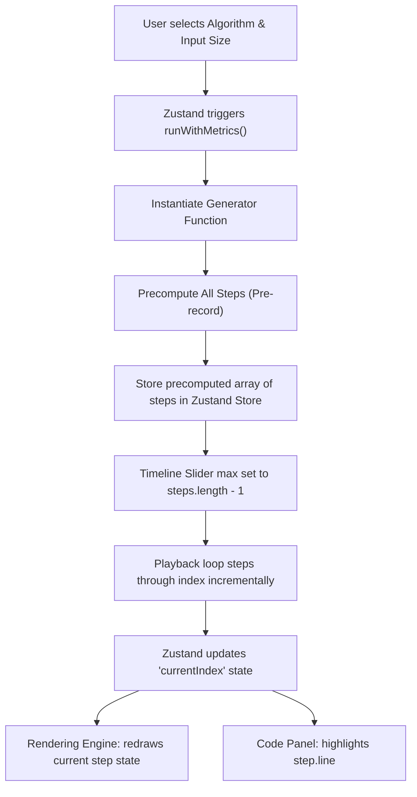
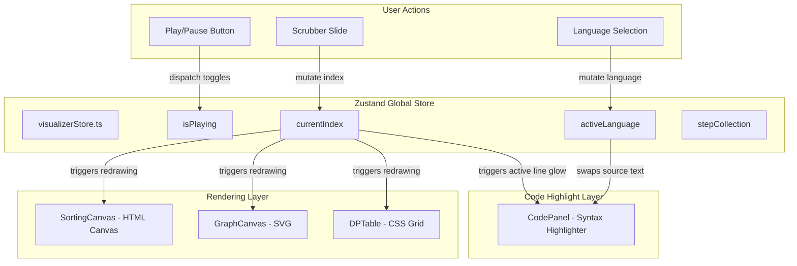

# ThunderStorm

### *The portfolio-grade algorithm visualizer powered by step generators and lightning-fast animations.*

An advanced, high-performance educational platform designed for computer science students and software engineers to visualize, analyze, and master Data Structures and Algorithms (DSA). ThunderStorm decouples algorithm logic from the rendering layer by utilizing a generator-based step recording architecture, unlocking real-time control, interactive timeline scrubbing, multi-language code synchronization, side-by-side comparison, and gamified Battle Modes.

---

[](LICENSE)
[](https://www.typescriptlang.org/)
[](https://nextjs.org/)
[](https://web.dev/progressive-web-apps/)
[](https://github.com/harshwardhan1507/Thunderstorm)
[](https://web.dev/measure/)
[](https://web.dev/measure/)

---

## Banner

```
┌────────────────────────────────────────────────────────────────────────────┐
│                                                                            │
│                                 hero.png                                   │
│                                                                            │
└────────────────────────────────────────────────────────────────────────────┘
```
*Note: The `hero.png` graphic should be placed directly in the main repository assets. It illustrates the desktop split-screen interface in dark mode. On the left, an active Sorting Canvas renders an array of 50 elements undergoing Heap Sort, with comparisons highlighted in electric blue and swaps in lightning yellow, under a soft purple glow. On the right, a synchronized Java code panel highlights the exact loop execution line with a glowing border. A floating metrics HUD shows comparisons, swaps, and execution times.*

---

## Table of Contents
1. [Introduction](#1-introduction)
2. [Features](#2-features)
3. [Screenshots](#3-screenshots)
4. [Live Demo](#4-live-demo)
5. [Architecture Overview](#5-architecture-overview)
6. [Folder Structure](#6-folder-structure)
7. [Technology Stack](#7-technology-stack)
8. [Installation](#8-installation)
9. [Usage](#9-usage)
10. [Design Philosophy](#10-design-philosophy)
11. [Performance Optimizations](#11-performance-optimizations)
12. [Accessibility (a11y)](#12-accessibility-a11y)
13. [Educational Value](#13-educational-value)
14. [Supported Algorithms](#14-supported-algorithms)
15. [Metrics System](#15-metrics-system)
16. [Roadmap](#16-roadmap)
17. [Contributing Guide](#17-contributing-guide)
18. [Project Principles](#18-project-principles)
19. [Frequently Asked Questions (FAQ)](#19-frequently-asked-questions-faq)
20. [License](#20-license)
21. [Credits](#21-credits)

---

## 1. Introduction

### What is ThunderStorm?
ThunderStorm is a portfolio-grade, interactive educational application that visualizes core computer science algorithms and data structures. It covers sorting, graphs, trees, pathfinding, dynamic programming, and greedy approaches. Built using Next.js 14, TypeScript, GSAP, and Framer Motion, it offers students and engineers a visual companion for DSA education.

### Why Does It Exist?
Traditional algorithm visualizers are often simple utility demonstrations rather than robust educational platforms. Many suffer from three fundamental limitations:
1. **Tight Coupling**: They couple the algorithm code directly with UI timers (`setTimeout` or `setInterval`), making pause, rewind, speed adjustment, and reverse execution difficult or impossible.
2. **Static Code Reference**: They display static snippets that do not reflect what the visualization is actively executing, forcing the user to guess how the visual state maps to the actual lines of code.
3. **Outdated Design**: Many use generic layouts, high-latency DOM updates, and lack responsive designs, failing to engage users.

ThunderStorm addresses these issues by providing a structured design system, precise visual animations, and a generator-based playback engine.

```
                  THE TRADITIONAL APPROACH vs. THUNDERSTORM
┌─────────────────────────────────────────┐   ┌─────────────────────────────────────────┐
│          TRADITIONAL VISUALIZER         │   │               THUNDERSTORM              │
├─────────────────────────────────────────┤   ├─────────────────────────────────────────┤
│ • Tight code-animation coupling         │   │ • Generator-based step recording        │
│ • setTimeout/setInterval timers         │   │ • Full timeline scrubbing (rewind/play) │
│ • Non-responsive code snippets          │   │ • Line-level synchronized code panel    │
│ • Heavy DOM elements (slow render)      │   │ • Double-buffered Canvas & SVG render   │
│ • No side-by-side performance testing   │   │ • Compare & Battle Modes on shared data │
└─────────────────────────────────────────┘   └─────────────────────────────────────────┘
```

### The Educational Problem It Solves
When learning DSA, students struggle to bridge the gap between abstract mathematical concepts and concrete code implementations. Static text describes execution linearly, while visualizers show shapes moving without showing the code that moves them. 

ThunderStorm acts as a bridge. By linking every visual event (like comparisons, swaps, or traversals) to a specific line in multiple popular languages (Java, Python, C++, JavaScript), the user gains immediate, intuitive understanding of code execution.

### Why It Is Different
* **Generator-Based Playback**: By leveraging JavaScript generator functions (`function*`), ThunderStorm records algorithm steps as pure data. The UI controls playback speed and direction independently.
* **Synchronized Multi-Language Panel**: The user can switch between Java, Python, C++, and JavaScript code styles mid-execution. The active line is highlighted synchronously with the visual animation.
* **Battle Mode**: A gamified testing environment where two different algorithms race side-by-side on the identical input dataset. Real-time statistics (comparisons, swaps, execution times) are compared to declare the most efficient algorithm.
* **Premium Theme**: Designed using a dark grey layout with purple radial glows, electric blue highlights, and lightning yellow flashes.

---

## 2. Features

| Category | Feature | Technical Implementation | Educational Benefit |
| :--- | :--- | :--- | :--- |
| **Playback** | Timeline Scrubber | Precomputed generator steps mapped to an interactive range input. | Allows users to scrub back and forth to examine complex loops. |
| **Playback** | Variable Speed | Playback timer interval dynamic scale mapping. | Users can speed up runs or slow them down to examine details. |
| **Visualization**| High-Contrast Canvas | Custom HTML Canvas double-buffered draw cycle for sorting. | High-performance visualization of 100+ items without DOM lag. |
| **Visualization**| Interactive SVG Graphs | Node-edge layout using SVGs with interactive weights and paths. | Helps users understand graph traversal and connections. |
| **Visualization**| 2D DP Table | Dynamically populated CSS Grid with row/column highlights. | Visualizes how subproblems populate matrix cells. |
| **Code Sync** | Multi-Language Code Panel | React-Syntax-Highlighter syncing with the active step's line number. | Matches code syntax with execution states in real-time. |
| **Code Sync** | Language Switcher | Zustand state tracking for active code representation (Java/Python/C++/JS). | Helps users understand how algorithms are implemented in different languages. |
| **Educational** | Explanation Panel | Dynamic content mapping for Intuition, Pros/Cons, and Use Cases. | Consolidates academic details alongside visual examples. |
| **Educational** | Complexity Growth Chart | Canvas/SVG curve plotting showing growth rates ($O(1)$ to $O(n^2)$). | Visualizes growth rates as input size $n$ increases. |
| **Modes** | Comparison Mode | Parallel Zustand clock driving two independent generator queues. | Direct comparison of two algorithms on identical input data. |
| **Modes** | Battle Mode | Side-by-side race with automatic winner declaration. | Demonstrates differences in runtime efficiency. |
| **PWA** | Installable PWA | Next-PWA with service workers, manifest.json, and caching. | Offline access on mobile and desktop platforms. |
| **Performance** | GSAP Hardware Acceleration| CSS Transform and Canvas rendering accelerated by GSAP timelines. | Smooth 60 FPS transitions and animations. |

---

## 3. Screenshots

Below are the design layouts and placeholders for the core screens of the ThunderStorm platform.

### Landing Page
```
┌────────────────────────────────────────────────────────────────────────────┐
│ NAVBAR: Logo + Name [ThunderStorm]                 Search  Bell  Theme  AV │
├────────────────────────────────────────────────────────────────────────────┤
│                                                                            │
│                           ⚡ Algorithm Visualizer                           │
│                                                                            │
│                     Visualize Algorithms. Master the Storm.                │
│             Step-by-step DSA visualization for learners and builders.      │
│                                                                            │
│                     [ Explore Free ]    [ Launch Visualizer ⚡ ]           │
│                                                                            │
│   ┌───────────────────────────────┐     ┌───────────────────────────────┐  │
│   │ 📊 Sorting                    │     │ 🌐 Graphs                     │  │
│   │ Visual and compared sorting   │     │ Node structures, BFS, DFS     │  │
│   └───────────────────────────────┘     └───────────────────────────────┘  │
│                                                                            │
│                         Purple radial glow background                      │
└────────────────────────────────────────────────────────────────────────────┘
```

### Sorting Visualizer
```
┌────────────────────────────────────────────────────────────────────────────┐
│ Breadcrumb: Home > Sorting > Quick Sort                                    │
├────────────────────────────────────────────────────────────────────────────┤
│ [Bubble] [Merge] [*Quick*] [Heap]                                          │
├──────────────────────────────────────────────┬─────────────────────────────┤
│                                              │ Language: [Java] [C++] [*JS*]│
│  VISUALIZATION CANVAS                        ├─────────────────────────────┤
│  (Quick Sort in Action)                      │  1  function quickSort(arr) │
│  - Active comparisons: Electric Blue         │  2    if (arr.length <= 1)  │
│  - Swap events: Lightning Yellow            │ ▶3    let pivot = arr[0];   │
│                                              │  4    ...                   │
├──────────────────────────────────────────────┴─────────────────────────────┤
│ ◀  ⏸  ▶  Scrub: ━━━━━━━━━━━━━●─── Step 124/256   Speed: ──●── Size: [ 50 ] │
├────────────────────────────────────────────────────────────────────────────┤
│ METRICS: Comparisons: 184 | Swaps: 89 | Time: 1.4ms | Heap: 14MB (approx)  │
└────────────────────────────────────────────────────────────────────────────┘
```

### Graphs Visualizer
```
┌────────────────────────────────────────────────────────────────────────────┐
│ Breadcrumb: Home > Graphs > Breadth-First Search                           │
├────────────────────────────────────────────────────────────────────────────┤
│ [*BFS*] [DFS]                                                              │
├──────────────────────────────────────────────┬─────────────────────────────┤
│                                              │ Language: [Java] [*Python*] │
│  SVG GRAPH CANVAS                            ├─────────────────────────────┤
│  - Nodes: Default Dark Gray                 │  1  def bfs(graph, start):  │
│  - Traversal queue: Storm Violet             │  2    visited = set()       │
│  - Current node: Violet Ripple               │ ▶3    queue = [start]       │
│                                              │  4    while queue:          │
├──────────────────────────────────────────────┴─────────────────────────────┤
│ ◀  ⏸  ▶  Scrub: ━━━━━━━━━━━━━●─── Step 42/85     Speed: ──●── Speed Scale  │
├────────────────────────────────────────────────────────────────────────────┤
│ METRICS: Nodes Visited: 7/12 | Queue Size: 3 | Path Length: N/A            │
└────────────────────────────────────────────────────────────────────────────┘
```

### Trees Visualizer
```
┌────────────────────────────────────────────────────────────────────────────┐
│ Breadcrumb: Home > Trees > AVL Tree Rotation                               │
├────────────────────────────────────────────────────────────────────────────┤
│ [BST] [*AVL*] [Heap]                                                       │
├──────────────────────────────────────────────┬─────────────────────────────┤
│                                              │ Language: [*C++*] [JS]      │
│  SVG TREE CANVAS                             ├─────────────────────────────┤
│  - Visited Node: Storm Violet                │  1  Node* rotateRight(Node* y)│
│  - Rotated Link: Lightning Flash             │  2    Node* x = y->left;    │
│  - Root Node: Blue Glow                      │ ▶3    Node* T2 = x->right;  │
│                                              │  4    x->right = y;         │
├──────────────────────────────────────────────┴─────────────────────────────┤
│ ◀  ⏸  ▶  Scrub: ━━━━━━━━━━━━━●─── Step 12/28     Speed: ──●── Speed Scale  │
├────────────────────────────────────────────────────────────────────────────┤
│ METRICS: Tree Height: 4 | Balance Factor: 0 | Rotations Performed: 1       │
└────────────────────────────────────────────────────────────────────────────┘
```

### Dynamic Programming (DP) Visualizer
```
┌────────────────────────────────────────────────────────────────────────────┐
│ Breadcrumb: Home > DP > 0/1 Knapsack                                       │
├────────────────────────────────────────────────────────────────────────────┤
│ [Fibonacci] [*Knapsack*] [LCS]                                             │
├──────────────────────────────────────────────┬─────────────────────────────┤
│                                              │ Language: [*Java*] [Python] │
│  DP TABLE CANVAS (2D Grid representation)    ├─────────────────────────────┤
│  - Current subproblem: Highlighted cell      │  1  int knapSack(int W, ...)│
│  - Dependencies: Colored cell pointers       │  2    int K[][] = new int...│
│                                              │ ▶3    K[i][w] = Math.max(...│
├──────────────────────────────────────────────┴─────────────────────────────┤
│ ◀  ⏸  ▶  Scrub: ━━━━━━━━━━━━━●─── Step 78/150    Speed: ──●── Speed Scale  │
├────────────────────────────────────────────────────────────────────────────┤
│ METRICS: Subproblems Solved: 48/60 | Memory Allocation: O(N*W)             │
└────────────────────────────────────────────────────────────────────────────┘
```

### Comparison Mode
```
┌────────────────────────────────────────────────────────────────────────────┐
│ Breadcrumb: Home > Compare Algorithms                                      │
├────────────────────────────────────────────────────────────────────────────┤
│ Select Algo A: [ Bubble Sort   v ]      Select Algo B: [ Merge Sort    v ] │
├──────────────────────────────────────────────┬─────────────────────────────┤
│ BUBBLE SORT VISUALIZATION CANVAS             │ MERGE SORT VISUALIZATION CANVAS     │
│ - Array size: 40                             │ - Array size: 40 (Identical Data)  │
│ - Speed: 1.5x                                │ - Speed: 1.5x                       │
├──────────────────────────────────────────────┼─────────────────────────────┤
│ Comparisons: 780                             │ Comparisons: 184            │
│ Swaps: 382                                   │ Swaps: 120                  │
│ Measured Time: 5.8ms                         │ Measured Time: 1.1ms        │
├──────────────────────────────────────────────┴─────────────────────────────┤
│ Controls:     [ ▶ Start Side-by-Side Playback ]         [ ↺ Reset Data ]   │
└────────────────────────────────────────────────────────────────────────────┘
```

### Battle Mode
```
┌────────────────────────────────────────────────────────────────────────────┐
│ Breadcrumb: Home > Battle Mode                                             │
├────────────────────────────────────────────────────────────────────────────┤
│ [   BATTLE: Quick Sort  vs  Heap Sort   ]                                  │
├──────────────────────────────────────────────┬─────────────────────────────┤
│ QUICK SORT (RUNNING...)                      │ HEAP SORT (RUNNING...)      │
│ ▃▅▇▃▅█▃▅▇▃▅█▃▅                               │ ▃▅▇▃▅█▃▅▇▃▅█▃▅              │
├──────────────────────────────────────────────┼─────────────────────────────┤
│ Comparisons: 242                             │ Comparisons: 298            │
│ Swaps: 180                                   │ Swaps: 145                  │
│ Time: 0.8ms                                  │ Time: 1.2ms                 │
├──────────────────────────────────────────────┴─────────────────────────────┤
│                  🏆 BATTLE RESULT: Quick Sort Wins! 🏆                      │
│        (Execution 1.5x faster, 18.7% fewer comparisons performed)          │
│                [ Winner celebrated with Thunder Burst ]                    │
└────────────────────────────────────────────────────────────────────────────┘
```

### Settings Panel
```
┌────────────────────────────────────────────────────────────────────────────┐
│ SETTINGS                                                               [X] │
├────────────────────────────────────────────────────────────────────────────┤
│ Theme:           [● Dark Theme]   [o Light Theme]   [o System Default]     │
│ Reduced Motion:  [o Enabled]      [● Disabled] (Uses GSAP animations)      │
│ Font Family:     [● Geist Mono]   [o Fira Code]     [o Source Code Pro]    │
│ Sound FX:        [● Enabled]      [o Disabled]                             │
│ Max Array Size:  [ 150 ] (Canvas limitation safety guard)                  │
└────────────────────────────────────────────────────────────────────────────┘
```

### Code Panel
```
┌────────────────────────────────────────────────────────────────────────────┐
│ CODE PANEL - JavaScript                                                    │
├────────────────────────────────────────────────────────────────────────────┤
│  1  function bubbleSort(arr) {                                             │
│  2    for (let i = 0; i < arr.length - 1; i++) {                           │
│  3      for (let j = 0; j < arr.length - i - 1; j++) {                     │
│ ▌4        if (arr[j] > arr[j + 1]) {        <-- Active Execution Line      │
│  5          let temp = arr[j];                                             │
│  6          arr[j] = arr[j + 1];                                           │
│  7          arr[j + 1] = temp;                                             │
│  8        }                                                                │
│  9      }                                                                  │
│ 10    }                                                                    │
│ 11  }                                                                      │
└────────────────────────────────────────────────────────────────────────────┘
```

### Timeline Scrubber
```
┌────────────────────────────────────────────────────────────────────────────┐
│ TIMELINE SCRUBBER                                                          │
├────────────────────────────────────────────────────────────────────────────┤
│                                                                            │
│ 0 ━━━━━━━━━━━━━━━━━━━━━━━━━━━━━━━━━━━━━●──────────────────────── 512 Steps  │
│                                      (Step 342 / 512 — 66% Complete)       │
│                                                                            │
└────────────────────────────────────────────────────────────────────────────┘
```

---

## 4. Live Demo

Try the interactive platform live or explore the codebase:
* **GitHub Repository**: [harshwardhan1507/Thunderstorm](https://github.com/harshwardhan1507/Thunderstorm)
* **Live Deployment**: [https://thunderstorm-dsa.vercel.app](https://thunderstorm-dsa.vercel.app)

---

## 5. Architecture Overview

ThunderStorm is built on a clean architectural pattern that separates core algorithm logic, reactive state tracking, and high-performance visual rendering.

### The Problem of Naive Animation Routing
Most open-source algorithm visualizers embed layout and animation code directly inside the sorting loops. For example:
```typescript
// NAIVE ANTI-PATTERN
async function bubbleSort(arr) {
  for(let i=0; i<arr.length; i++) {
    if(arr[i] > arr[i+1]) {
      swap(arr, i, i+1);
      updateDOM();
      await sleep(100); // Tightly couples time and rendering!
    }
  }
}
```
This design makes pausing, rewinding, speed adjustments, and side-by-side execution difficult.

### Generator-Based Step Recording
ThunderStorm decouples time and execution by using JavaScript Generator Functions (`function*`). The algorithm executes instantly behind the scenes, yielding a list of state changes called "steps."

```typescript
// THUNDERSTORM GENERATOR ARCHITECTURE
export function* bubbleSort(arr: number[]): Generator<SortStep> {
  const array = [...arr];
  for (let i = 0; i < array.length - 1; i++) {
    for (let j = 0; j < array.length - i - 1; j++) {
      // Yield comparison state
      yield { array: [...array], comparing: [j, j + 1], swapped: false, line: 3 };
      if (array[j] > array[j + 1]) {
        [array[j], array[j + 1]] = [array[j + 1], array[j]];
        // Yield swap state
        yield { array: [...array], comparing: [j, j + 1], swapped: true, line: 4 };
      }
    }
  }
}
```

Each yielded object contains:
* The snapshot of the dataset at that moment.
* The indices of elements being compared or swapped.
* A flag representing the operation type (comparison, swap, traversal).
* A line reference mapping the action to a specific line in the synchronized code panel.

### Flowchart: Generator Execution and State Processing


### The State Sync Pipeline
Zustand acts as the centralized store, coordinating user inputs, step updates, the rendering canvas, and the syntax highlighter.



### The Animation Pipeline
Zustand handles user interface transitions (collapsing panels, theme switches, modal pop-ups) via Framer Motion. Algorithm rendering updates (swapping bars, pulsing graph nodes) are handled by GSAP within React `useEffect` hooks. This separation prevents visual lag:

```
                  ANIMATION ENGINE SEPARATION OF RESPONSIBILITY
┌─────────────────────────────────────────┐   ┌─────────────────────────────────────────┐
│              FRAMER MOTION              │   │                  GSAP                   │
├─────────────────────────────────────────┤   ├─────────────────────────────────────────┤
│ • Page Transitions                      │   │ • Canvas Bar Swaps                      │
│ • Sidebar Collapses / Expansions        │   │ • SVG Graph Node Traversal Pulsing      │
│ • Modal Windows                         │   │ • Complexity Curve Draw Paths           │
│ • Control Panel Layout Changes          │   │ • Staggered Particle Completion Bursts  │
└─────────────────────────────────────────┘   └─────────────────────────────────────────┘
```

---

## 6. Folder Structure

Below is an overview of the directory structure and the responsibilities of each module.

```
thunderstorm/
├── .agents/                        # Local developer configuration files
├── app/                            # Next.js App Router root layout and pages
│   ├── layout.tsx                  # Global HTML wrapper, metadata, and fonts
│   ├── page.tsx                    # Landing page with feature overview
│   ├── sorting/                    # Sorting visualizer route
│   │   └── page.tsx
│   ├── graphs/                     # Graph visualizer route
│   │   └── page.tsx
│   ├── pathfinding/                # Pathfinding visualizer route
│   │   └── page.tsx
│   ├── dp/                         # Dynamic Programming visualizer route
│   │   └── page.tsx
│   ├── greedy/                     # Greedy algorithm visualizer route
│   │   └── page.tsx
│   ├── trees/                      # Tree structure operations route
│   │   └── page.tsx
│   └── compare/                    # Side-by-side comparison & Battle Mode route
│       └── page.tsx
├── components/                     # Shared UI components
│   ├── visualizers/                # High-performance canvas and SVG engines
│   │   ├── SortingCanvas.tsx       # Double-buffered Canvas renderer
│   │   ├── GraphCanvas.tsx         # Node-edge SVG diagram generator
│   │   ├── GridCanvas.tsx          # 2D Grid map for Dijkstra and A* pathfinding
│   │   ├── DPTable.tsx             # Dynamic matrix for DP tabulation
│   │   └── TreeCanvas.tsx          # SVG representation for binary trees
│   ├── controls/                   # Playback inputs and parameters panel
│   │   ├── SpeedSlider.tsx         # Dynamic animation rate modifier
│   │   ├── PlayPauseButton.tsx     # central clock trigger
│   │   ├── AlgorithmSelector.tsx   # Selector for algorithm categories
│   │   ├── ArraySizeInput.tsx      # Slider to resize current input array
│   │   ├── MetricsPanel.tsx        # Floating metrics overlay
│   │   └── TimelineScrubber.tsx    # Drag-and-drop step slider
│   ├── code/                       # Multi-language syntax tracking
│   │   ├── CodePanel.tsx           # Active source display
│   │   ├── LanguageSelector.tsx    # mid-run language selector
│   │   └── LineHighlighter.tsx     # Highlights lines in the code panel
│   ├── educational/                # Pedagogy and information guides
│   │   └── AlgorithmExplanation.tsx# Dynamic text tabs
│   ├── charts/                     # Math graphs
│   │   └── ComplexityChart.tsx     # Complexity curve visualizer
│   └── layout/                     # Shell modules
│       ├── Navbar.tsx              # Top layout nav
│       └── ComplexityBadge.tsx     # Static Complexity badges
├── lib/                            # Business logic layer
│   ├── algorithms/                 # Raw DSA generator algorithms
│   │   ├── sorting/                # sorting steps generators
│   │   ├── graphs/                 # graph traversal steps generators
│   │   ├── trees/                  # tree operations steps generators
│   │   ├── dp/                     # DP steps generators
│   │   ├── greedy/                 # greedy steps generators
│   │   └── metadata.ts             # Static mathematical metadata
│   ├── generators/                 # Run helpers
│   │   ├── stepGenerator.ts        # precomputed step runners
│   │   └── runWithMetrics.ts       # Metrics collections helper
│   ├── animations/                 # Dedicated GSAP pipelines
│   │   ├── swapAnimation.ts        # Elastic bar animations
│   │   └── nodeAnimation.ts        # Graph traversal pulsing
│   └── snippets/                   # code representation blocks
│       ├── sorting/                # Java, C++, JS, Python files
│       ├── graphs/
│       ├── pathfinding/
│       ├── trees/
│       ├── dp/
│       └── greedy/
├── store/                          # Zustand state managers
│   └── visualizerStore.ts          # Centralized visual playback store
├── public/                         # Public assets
│   ├── manifest.json               # PWA configuration manifest
│   └── icons/                      # App logos
└── types/                          # Shared typescript declarations
    └── algorithm.types.ts          # Standard interfaces for steps
```

---

## 7. Technology Stack

| Layer | Technology Choice | Version Constraint | Architecture Rationale |
| :--- | :--- | :--- | :--- |
| **Framework** | Next.js (App Router) | `^14.x` | Enables fast page load times and file-system routing. |
| **Language** | TypeScript | `^5.x` | Provides type-safety across different step types. |
| **UI Animation** | Framer Motion | `^11.x` | Handles CSS-driven layout transitions and UI controls. |
| **DSA Animation** | GreenSock (GSAP) | `^3.x` | High-performance timeline animations with elastic easing. |
| **State** | Zustand | `^4.x` | Lightweight state management without boilerplate code. |
| **Rendering** | HTML Canvas | Core Web API | Used for high-frequency sorting visualization. |
| **Rendering** | SVG | Core Web XML | Structured nodes and paths for graphs and trees. |
| **Syntax Highlighting**| react-syntax-highlighter| `^15.x` | High-performance styling and line highlighting. |
| **PWA** | next-pwa | `^5.6` | Automatic PWA compilation and offline support. |
| **Styling** | Tailwind CSS | `^3.x` | Custom utility classes matching the design token system. |
| **Deployment** | Vercel | Production | Native support for Next.js features. |

---

## 8. Installation

Ensure you have [Node.js v18.0.0 or higher](https://nodejs.org/) and [npm v9.0.0 or higher](https://www.npmjs.com/) installed on your machine.

### 1. Clone the Repository
```bash
git clone https://github.com/harshwardhan1507/Thunderstorm.git
cd Thunderstorm
```

### 2. Install Project Dependencies
Install dependencies using standard npm:
```bash
npm install
```

### 3. Start the Local Development Server
Launch the development server:
```bash
npm run dev
```
Open [http://localhost:3000](http://localhost:3000) in your browser to view the application.

### 4. Create a Production Build
Compile the application:
```bash
npm run build
```

### 5. Launch the Local Production Server
Run the built production application locally:
```bash
npm run start
```

---

## 9. Usage

### Sorting
1. Navigate to `/sorting` via the navigation sidebar.
2. Select your target sorting algorithm (Bubble, Merge, Quick, Heap) from the tabs.
3. Adjust the array size slider in the control panel to generate a new dataset.
4. Click the central **Play** button to watch the sorting process.
5. Drag the **Timeline Scrubber** to inspect specific state changes.
6. Switch the language dropdown to see how the algorithm executes in Java, Python, C++, or JS.

### Graphs & Pathfinding
1. Go to `/graphs` or `/pathfinding` routes.
2. Click on the canvas grid to draw custom obstacles and walls.
3. Select your target traversal strategy (BFS, DFS, Dijkstra, A*).
4. Drag-and-drop the **Start Node** and **Target Node** on the grid.
5. Click **Play** to watch the search expand. The traversal queue is highlighted in storm violet, and the final path is drawn with a green success line.

### Comparison Mode
1. Click the **Compare Mode** link in the sidebar to open the `/compare` view.
2. Select two algorithms to run side-by-side (e.g., Quick Sort vs. Bubble Sort).
3. Click **Start Race** to run both algorithms on the identical input dataset simultaneously.
4. Review the comparative table showing time, comparison counts, and swaps side-by-side.

### Battle Mode
1. Enter `/compare?mode=battle` or click **Battle Mode** in the navigation menu.
2. Choose your competitor algorithms.
3. Press **Start Battle** to launch the race.
4. When both runs complete, a winner card will appear in the center with a GSAP particle burst animation.

### Shareable Run URLs
Encode the current state of a visualization inside a shareable URL. Copy the URL from the share sheet to share the configuration with others:
* Share Quick Sort with 100 elements: `/sorting?algo=quick&size=100&speed=2`
* Share an A* maze setup: `/pathfinding?algo=astar&grid=preset-maze`
* Share a Merge vs. Bubble comparison: `/compare?a=bubble&b=merge&size=80`

---

## 10. Design Philosophy

Every architectural and technology choice in ThunderStorm was selected to balance rendering performance and educational value.

```
┌────────────────────────────────────────────────────────────────────────────┐
│                             DESIGN DECISION MAP                            │
├────────────────────────────────────────────────────────────────────────────┤
│ • Why Generators?   ─► Precomputes steps to enable pause & rewind.         │
│ • Why GSAP?         ─► Accurate tween tracking (avoiding CSS transition lag)│
│ • Why Framer Motion?─► Handles route transitions and menu layouts.          │
│ • Why HTML Canvas?  ─► Low-latency rendering of large arrays.              │
│ • Why SVGs?         ─► Interactive DOM nodes and links for trees/graphs.   │
│ • Why Zustand?      ─► High-frequency state updates without re-renders.     │
└────────────────────────────────────────────────────────────────────────────┘
```

### Why Generators?
Using standard Javascript loops with `await sleep()` blocks visualizers by pausing execution on the main thread, making step-by-step rewinding and variable speed adjustments difficult.

By leveraging JavaScript Generator Functions (`function*`), ThunderStorm executes the algorithm instantly behind the scenes, yielding a list of state changes called "steps." This precomputed list allows the user to navigate back and forth along the timeline without recalculating the algorithm.

### Why GreenSock (GSAP)?
GSAP was chosen for canvas and SVG rendering due to its performance and precise timeline controls:
* **Tween Syncing**: It synchronizes multiple animations (like moving two bars and changing their colors) in a unified timeline.
* **Easing**: It supports elastic and bounce easing out-of-the-box, providing clear visual feedback during swaps and traversals.
* **Control**: It allows animations to be played, paused, reversed, or scrubbed at any speed.

### Why Framer Motion?
Framer Motion was selected for general React UI animations, such as sidebar navigation collapses, modal dialog overlays, and page transitions. GSAP manages the high-frequency animations inside the canvas/SVG element, while Framer Motion handles standard layout changes.

### Why HTML Canvas?
For sorting visualizations, we render up to 150 items. Manipulating 150 DOM nodes can cause layout thrashing and drop the frame rate. ThunderStorm uses HTML Canvas to redraw elements directly on a single pixel grid, keeping operations at 60 FPS even with larger arrays.

### Why SVG (Scalable Vector Graphics)?
Graphs and trees are interactive structures where users select nodes, drag endpoints, or add nodes. HTML Canvas is a pixel grid, making it difficult to detect clicks on individual elements. SVGs represent nodes and links as DOM elements, enabling interactivity, custom styling, and hover states.

### Why Zustand?
React's default Context API is not optimized for high-frequency updates. Triggering state updates on every animation frame can cause the entire page to re-render. Zustand uses a selector-based subscription model, ensuring that only the components relying on the active step index re-render during playback.

### Why Next.js?
Next.js provides a clean App Router for organizing visualizer categories into routes, alongside out-of-the-box support for SEO optimization, static metadata pre-generation, and simple deployment integrations.

---

## 11. Performance Optimizations

### 60 FPS Target Architecture
To maintain a smooth 60 FPS frame rate, ThunderStorm keeps algorithm execution logic, state mutation, and visual rendering separate.

```
 ┌─────────────────┐       ┌───────────────┐       ┌───────────────────┐
 │ Algorithm run   │  ──►  │ Zustand Store │  ──►  │ Rendering Canvas  │
 │ (yields states) │       │ (state cache) │       │ (double buffered) │
 └─────────────────┘       └───────────────┘       └───────────────────┘
```

### Canvas Optimizations
* **Double Buffering**: Changes are rendered to an offscreen canvas before being drawn to the visible screen, preventing screen flicker.
* **Selective Redrawing**: The canvas only updates regions that have changed, avoiding full redraws when only a few elements are being modified.

### React Memoization
We use `React.memo` on the code panels, navigation bars, and stats cards. This ensures that only components affected by changes (such as the active execution line highlight) update, preventing unnecessary re-renders of the rest of the interface.

### Lazy Loading and Code Splitting
Visualizer pages (such as `/dp` or `/trees`) are code-split and loaded on-demand. This reduces the initial bundle size, allowing the landing page to load quickly on slower networks.

---

## 12. Accessibility (a11y)

### Keyboard Navigation Map
ThunderStorm is fully navigable without a mouse:

| Keyboard Input | Mapped Action |
| :--- | :--- |
| `Spacebar` | Toggle Play / Pause state of visual clock. |
| `Right Arrow` | Step forward one frame. |
| `Left Arrow` | Step backward one frame. |
| `Up Arrow` | Increase animation speed. |
| `Down Arrow` | Decrease animation speed. |
| `Ctrl + K` | Focus Global Command Search Input. |
| `Ctrl + /` | Toggle Light / Dark contrast mode. |
| `Escape` | Close active dialogs, settings modals, or search dropdowns. |

### Color Contrast (AA/AAA Compliance)
All design colors are chosen to meet WCAG AA and AAA accessibility guidelines. Semantic labels are highlighted with high-contrast text tags (such as electric blue text on a dark gray background).

### Reduced Motion Support
The application checks user system preferences for reduced motion (`prefers-reduced-motion`). If enabled, elastic eases and particle effects are disabled, and elements update instantly without animations.

---

## 13. Educational Value

### Step-by-Step Execution
Traditional visualizers run algorithms from start to finish without pausing. ThunderStorm precomputes steps using generator functions, allowing students to step forward and backward to analyze complex loops and recursion at their own pace.

### Synchronized Code Panels
Visual changes are mapped to specific lines of code in multiple languages. When a swap occurs, the corresponding line of code highlights in real-time, helping students connect abstract concepts to concrete code.

### Detailed Metrics
In addition to visual animations, ThunderStorm tracks metrics like comparison counts and swap operations. This helps students analyze how different algorithms perform on identical datasets.

---

## 14. Supported Algorithms

### Sorting
| Algorithm | Best Time | Average Time | Worst Time | Space | Stable | In-Place | Use Case |
| :--- | :--- | :--- | :--- | :--- | :--- | :--- | :--- |
| **Bubble Sort** | $\mathcal{O}(n)$ | $\mathcal{O}(n^2)$ | $\mathcal{O}(n^2)$ | $\mathcal{O}(1)$ | Yes | Yes | Small datasets, nearly sorted arrays. |
| **Merge Sort** | $\mathcal{O}(n \log n)$| $\mathcal{O}(n \log n)$| $\mathcal{O}(n \log n)$| $\mathcal{O}(n)$ | Yes | No | Large arrays, stable external sorting. |
| **Quick Sort** | $\mathcal{O}(n \log n)$| $\mathcal{O}(n \log n)$| $\mathcal{O}(n^2)$ | $\mathcal{O}(\log n)$| No | Yes | General-purpose high-speed in-memory sort. |
| **Heap Sort** | $\mathcal{O}(n \log n)$| $\mathcal{O}(n \log n)$| $\mathcal{O}(n \log n)$| $\mathcal{O}(1)$ | No | Yes | Embedded systems with strict space limits. |

### Graphs & Pathfinding
| Algorithm | Time Complexity | Space Complexity | Visited Nodes | Shortest Path Guarantee | Use Case |
| :--- | :--- | :--- | :--- | :--- | :--- |
| **BFS** | $\mathcal{O}(V + E)$ | $\mathcal{O}(V)$ | All visited | Yes (Unweighted graphs) | Finding nearest node or unweighted shortest path. |
| **DFS** | $\mathcal{O}(V + E)$ | $\mathcal{O}(V)$ | Stack order | No | Cycle detection, topological sorting. |
| **Dijkstra** | $\mathcal{O}((V + E) \log V)$| $\mathcal{O}(V)$ | Weighted priority| Yes | Weighted routing, network path optimizations. |
| **A\* Search** | $\mathcal{O}(b^d)$ | $\mathcal{O}(b^d)$ | Heuristic target | Yes (Admissible heuristic) | Game pathfinding, GPS navigation routing. |

### Trees
| Algorithm | Search Time | Insertion Time | Deletion Time | Balance Factor | Target Use Case |
| :--- | :--- | :--- | :--- | :--- | :--- |
| **BST** | $\mathcal{O}(\log n)$ avg / $\mathcal{O}(n)$ worst| $\mathcal{O}(\log n)$ avg / $\mathcal{O}(n)$ worst| $\mathcal{O}(\log n)$ avg / $\mathcal{O}(n)$ worst| None | Simple in-memory search key indexing. |
| **AVL Tree** | $\mathcal{O}(\log n)$ | $\mathcal{O}(\log n)$ | $\mathcal{O}(\log n)$ | Height diff $\le 1$ | Highly-read databases, strict height limits. |
| **Binary Heap**| $\mathcal{O}(1)$ peek / $\mathcal{O}(n)$ search| $\mathcal{O}(\log n)$ | $\mathcal{O}(\log n)$ extract | Balanced Tree | Priority queues, Dijkstra scheduler implementations. |

### Dynamic Programming (DP)
| Algorithm | Subproblems Count | Time Complexity | Space Complexity | Approach Type | Engineering Application |
| :--- | :--- | :--- | :--- | :--- | :--- |
| **Fibonacci** | $\mathcal{O}(n)$ | $\mathcal{O}(n)$ | $\mathcal{O}(n)$ array / $\mathcal{O}(1)$ memo| Memoization / Tab | Resource scheduling, sequence generation. |
| **0/1 Knapsack**| $\mathcal{O}(N \cdot W)$ | $\mathcal{O}(N \cdot W)$ | $\mathcal{O}(N \cdot W)$ matrix | 2D Tabulation | Budget allocation, cargo loading optimizations. |
| **LCS** | $\mathcal{O}(m \cdot n)$ | $\mathcal{O}(m \cdot n)$ | $\mathcal{O}(m \cdot n)$ matrix | 2D Tabulation | Diff file comparison tools, bioinformatics sequences. |

### Greedy
| Algorithm | Time Complexity | Space Complexity | Opt. Choice | Approach Type | Implementation Use Case |
| :--- | :--- | :--- | :--- | :--- | :--- |
| **Activity Selection**| $\mathcal{O}(n \log n)$ | $\mathcal{O}(n)$ | Earliest finish| Greedy Sort | Meeting room scheduling, CPU task allocation. |
| **Huffman Coding** | $\mathcal{O}(n \log n)$ | $\mathcal{O}(n)$ | Lowest freq | Priority queue | Data compression (ZIP, JPEG files). |

---

## 15. Metrics System

The metrics system provides real-time performance data for each algorithm run.

### Measured Metrics
* **Execution Time ($ms$)**: Measured using `performance.now()`. It captures the time required to precompute the generator steps, representing the algorithm's execution time.
* **Comparisons**: Incremented each time the generator evaluates two values.
* **Swaps / Nodes Visited**: Tracks write operations (swaps) or graph traversals (nodes visited).
* **Space Complexity**: Displays the theoretical space complexity ($O(1)$, $O(n)$, etc.) for academic reference.
* **Heap Usage ($MB$)**: Measures Javascript heap allocation during execution.

### Browser Heap Limitations
The heap usage metric uses `performance.memory.usedJSHeapSize`. Users should note that:
1. **Chrome-Only**: This API is non-standard and is supported only in Chromium-based browsers (Chrome, Edge, Opera). It returns `0` in Firefox and Safari.
2. **Whole Heap Measurement**: The API returns the memory consumption of the entire JavaScript execution context (including Next.js and third-party scripts), not just the isolated algorithm execution.
3. **Estimation**: This metric is presented as an approximation of memory usage, not an absolute measurement.

---

## 16. Roadmap

### Phase 1: Core Engine & Sorting (Completed)
- [x] Set up Next.js 14, TypeScript, and Tailwind CSS.
- [x] Implement the Zustand visualizer store.
- [x] Create generator-based step runners for Bubble, Merge, Quick, and Heap Sort.
- [x] Build the double-buffered HTML Canvas sorting component.
- [x] Implement playback controls (Play, Pause, Step, Speed Slider).
- [x] Create the Timeline Scrubber.
- [x] Integrate the synchronized multi-language code panel (Java, C++, JS, Python).
- [x] Add the floating metrics panel.

### Phase 2: Graphs, Pathfinding & Trees (Completed)
- [x] Build the SVG-based Graph Canvas.
- [x] Implement BFS and DFS traversal generators.
- [x] Build the pathfinding grid supporting wall placement and start/end node dragging.
- [x] Implement Dijkstra and A* search visualizers.
- [x] Add tree visualization support (BST operations, AVL rotations, Binary Heap).
- [x] Style node states (traversal colors, root glow, link flashes).

### Phase 3: DP, Greedy & Explanations (Completed)
- [x] Build the 2D tabulation grid for DP (Fibonacci, 0/1 Knapsack, LCS).
- [x] Implement greedy algorithm visualizers (Activity Selection, Huffman Coding).
- [x] Create the Complexity Growth Chart ($O(1)$ to $O(n^2)$).
- [x] Add the educational explanations panel with tabbed sections (Intuition, Pros/Cons).

### Phase 4: Advanced Modes & Shareable URLs (Completed)
- [x] Implement side-by-side comparison mode on shared datasets.
- [x] Add Battle Mode with winner declarations and particle burst animations.
- [x] Build URL query parameter encoding (`/sorting?algo=quick&size=100&speed=2`) for sharing configurations.

### Phase 5: Polish & Deployment (Completed)
- [x] Set up PWA support using `next-pwa` with offline caching.
- [x] Add Framer Motion route-level page transitions.
- [x] Optimize GSAP animation timelines.
- [x] Deploy the application to Vercel.

### Phase 6: V2 Upgrades (Future)
- [ ] Add a Pseudocode tab to the code panel for beginners.
- [ ] Support custom user-uploaded JavaScript algorithm files.
- [ ] Implement WebAssembly-compiled Rust and C++ execution engines.

---

## 17. Contributing Guide

Thank you for contributing to ThunderStorm. Below are the project guidelines.

### Branch Naming Conventions
- New features: `feature/your-feature-name`
- Bug fixes: `bugfix/your-bug-name`
- Documentation updates: `docs/your-doc-name`

### Commit Message Guidelines
We use the Conventional Commits specification:
- `feat: add Tree visualizer component`
- `fix: resolve performance issue on grid resizing`
- `docs: update setup steps in README`
- `style: adjust layout paddings in code panel`

### Coding Standards
* **Strict TypeScript**: Avoid `any` types; define interfaces for new data structures.
* **Component Design**: Keep components focused on a single responsibility.
* **Animation Boundaries**: Use Framer Motion for UI transitions and GSAP for canvas/SVG elements.

### Pull Request Checklist
1. Branch updated with the latest changes from `main`.
2. Code builds without errors (`npm run build`).
3. Linter checks pass (`npm run lint`).
4. Type checks pass (`npm run tsc` or equivalent).
5. Verification details and screenshots included in the PR description.

---

## 18. Project Principles

1. **Separation of Concerns**: Keep algorithm logic separate from rendering code. Algorithms yield step data, and visualizers render that data.
2. **Visual Readability**: Design interfaces with clear contrast and color coding. Avoid overlays or visual clutter that distract from the visualization.
3. **Performance First**: Ensure animations run smoothly. Limit DOM updates, use Canvas for large datasets, and optimize Zustand state updates.
4. **Educational Focus**: Design controls, speed limits, and explanations to support learning and comprehension.

---

## 19. Frequently Asked Questions (FAQ)

#### Q1: Why did you build custom step generators instead of running algorithms asynchronously?
Running algorithms asynchronously (e.g., using `await sleep(delay)`) ties execution speed directly to the browser UI thread. Precomputing steps using generators allows the UI to control playback, support instant timeline scrubbing, and run step-by-step backward execution without re-running the algorithm.

#### Q2: How does the synchronized code panel work?
Each precomputed step generated by our algorithms includes a `line` property containing the line number currently executing. The UI store tracks this index, and the code panel applies highlight classes to the corresponding line in the syntax highlighter.

#### Q3: Does the timeline scrubber precompute all steps in advance?
Yes. When you select an algorithm and input size, the application runs the algorithm generator and stores the yielded steps in an array. This allows the timeline scrubber to jump to any step instantly.

#### Q4: Why use HTML Canvas for sorting but SVGs for graphs?
Sorting visualizers render up to 150 bars that animate frequently. Redrawing 150 HTML elements in the DOM can cause lag. HTML Canvas renders these updates on a single canvas pixel grid at 60 FPS. Graphs require user interaction (e.g., dragging nodes, clicking edges), which is easier to implement using SVG elements.

#### Q5: Is the memory heap measurement accurate on Firefox or Safari?
No. The heap measurement uses `performance.memory.usedJSHeapSize`, which is a non-standard API supported only in Chrome and Chromium-based browsers. On Firefox and Safari, the dashboard displays `N/A`. The dashboard labels this metric clearly as "Chrome only".

#### Q6: Why did you choose Zustand instead of Redux?
Zustand is a lightweight state management library with minimal boilerplate. It uses selector-based subscriptions, which ensures that only components that depend on changed state (like the active step index) re-render, keeping UI updates fast.

#### Q7: How does Battle Mode determine the winning algorithm?
Battle Mode runs competitor algorithms on the identical input dataset. The algorithm that completes with the lowest combined score—based on execution time, comparison counts, and swap operations—is declared the winner.

#### Q8: Can I add custom algorithms to the visualizer?
Yes. You can add algorithms by creating a generator function in `lib/algorithms/`, defining code snippets in `lib/snippets/`, and adding its metadata to `lib/algorithms/metadata.ts`.

#### Q9: How does the application support offline usage?
ThunderStorm uses `next-pwa` to set up service workers and local caching. Once installed on your device, the visualizers, code panels, and core features are available without an active internet connection.

#### Q10: How do you prevent GSAP and Framer Motion from conflicting?
We separate animation responsibilities: Framer Motion handles standard React UI transitions (such as sidebar collapses and modal windows), while GSAP controls the canvas rendering loop and SVG elements. They do not target the same DOM elements.

#### Q11: Why is Quick Sort's space complexity labeled as O(log n)?
Quick Sort is an in-place algorithm, but its recursive calls require call stack space. On average, the recursion stack size is $\mathcal{O}(\log n)$, which is reflected in the metrics panel.

#### Q12: How are Dijkstra's and A* algorithms visualized differently?
Dijkstra's algorithm explores nodes radially in all directions, which is shown as an expanding circle. A* uses a distance heuristic to direct the search toward the target, which is shown as a focused path.

#### Q13: Does ThunderStorm support mobile devices?
Yes. The interface is responsive. On screens narrower than 768px, the layout collapses the split view into tabbed selectors, allowing users to toggle between the visualization and the code panel.

#### Q14: How does the application respect user motion preferences?
The application checks the CSS media query `(prefers-reduced-motion: reduce)`. If enabled, it disables GSAP animations and elastic transitions, updating layout states instantly.

#### Q15: What is the purpose of the Complexity Growth Chart?
The chart plots mathematical curves ($O(1)$, $O(\log n)$, $O(n)$, etc.) to help students visualize how computational steps scale with input size $n$.

#### Q16: How do you verify the correctness of the generator steps?
We run Jest unit tests in the `lib/codeVisualizer/` directory. These tests run the generators to completion and verify that the final yielded array is sorted and matches reference datasets.

#### Q17: Can I deep-link to a specific visualization setup?
Yes. Every configuration change updates the URL query string (`?algo=quick&size=100`). Opening this URL restores the visualizer settings automatically.

#### Q18: What is the maximum array size supported by the canvas?
The canvas supports up to 150 items. This limit is set in the settings to ensure rendering performance remains high and bars are easily visible.

#### Q19: Why does AVL Tree insertion trigger a flashing arc animation?
The flashing arc represents tree rotation. This animation highlights the nodes and connections changing to balance the tree.

#### Q20: Is Next.js App Router required for this application?
Yes. Next.js App Router handles routing, layout caching, and bundle splitting, which reduces the initial load size for each visualizer page.

---

## 20. License

This project is licensed under the MIT License. See the [LICENSE](LICENSE) file for details.

---

## 21. Credits

### Libraries Used
* **Next.js**: React framework for routing and rendering.
* **GSAP (GreenSock)**: Animation engine for canvas updates.
* **Framer Motion**: React animation library for UI transitions.
* **Zustand**: State management library.
* **React Syntax Highlighter**: Syntax highlighting engine.
* **Tailwind CSS**: CSS utility framework.

### Inspiration
* **CodeHelp**: UI and design patterns.
* **VisuAlgo.net**: Algorithmic structure references.
* **USF CA Visualizer**: Visual mapping inspiration.

---

## Footer

### ⚡ Master the Storm. Star the Repository! ⚡
If you find this project helpful for learning or teaching DSA, please star our repository on GitHub! It helps more developers discover ThunderStorm.

Developed with ⚡ by [Harshwardhan](https://github.com/harshwardhan1507).