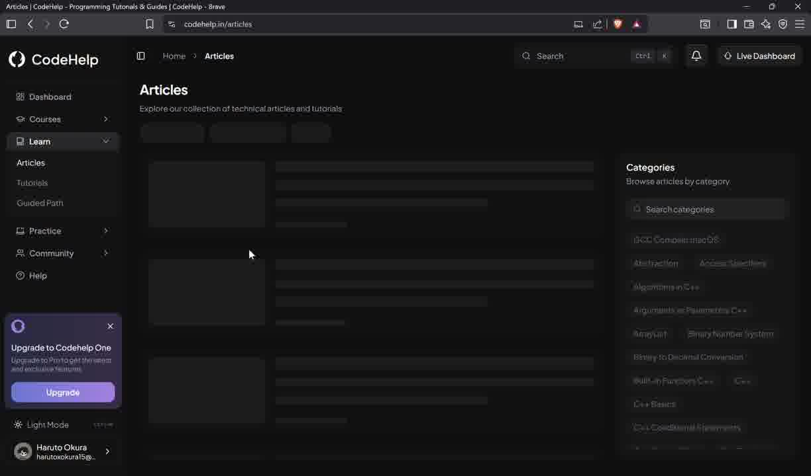
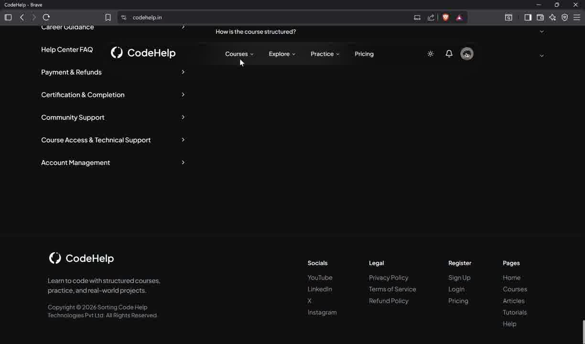
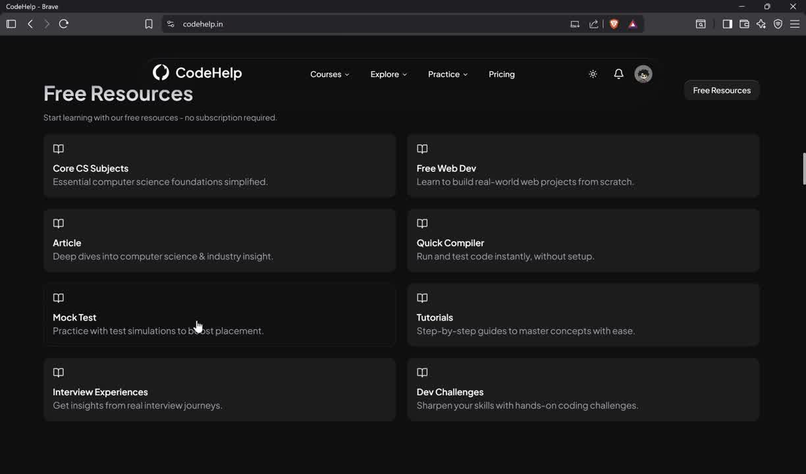
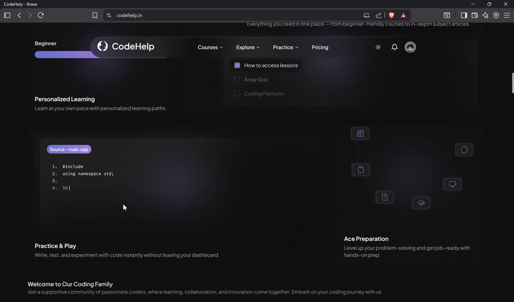
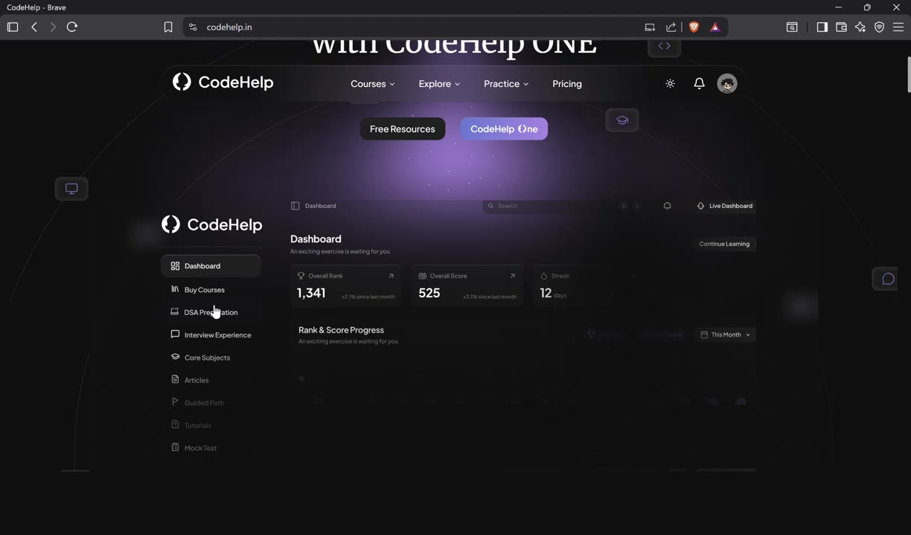

# ThunderStorm — UI Design Instructions
## Adapted from CodeHelp Visual Language

These are instructions for an AI (or developer) to replicate the CodeHelp
design system and adapt it to ThunderStorm. Every pattern is sourced directly
from the reference UI and remapped to ThunderStorm's content and storm identity.

---

## 1. DESIGN TOKENS

These are the exact values to use. Do not deviate unless noted.

### Colors

```css
/* Backgrounds */
--bg-base:         #0a0a0a;   /* page root — near black */
--bg-surface:      #141414;   /* cards, sidebars */
--bg-elevated:     #1c1c1c;   /* modals, dropdowns, hover states */
--bg-highlight:    #232323;   /* active sidebar item, selected row */

/* Borders */
--border-subtle:   #2a2a2a;   /* card edges, dividers — barely visible */
--border-default:  #333333;   /* inputs, prominent dividers */

/* Text */
--text-primary:    #f0f0f0;   /* headlines, active labels */
--text-secondary:  #888888;   /* subtitles, breadcrumbs, placeholders */
--text-muted:      #555555;   /* disabled items, dim metadata */

/* ThunderStorm Accent Palette */
--accent-purple:   #7c3aed;   /* primary CTA buttons, active badges */
--accent-violet:   #8b5cf6;   /* hover state on CTA, progress fills */
--accent-glow:     rgba(124, 58, 237, 0.18);  /* hero radial glow */

/* Algorithm State Colors (from spec) */
--color-compare:   #3B82F6;   /* electric blue — comparison */
--color-swap:      #FACC15;   /* lightning yellow — swap */
--color-traverse:  #A78BFA;   /* storm violet — traversal */
--color-success:   #22C55E;   /* green — path found */
--color-error:     #EF4444;   /* red — error state */
--color-code-line: #60A5FA;   /* active code line highlight */
```

### Typography

```css
/* Font Families */
--font-display: 'Inter', sans-serif;      /* headings, nav */
--font-mono:    'Geist Mono', monospace;  /* code panel, metrics */

/* Scale */
--text-xs:   0.75rem;    /* 12px — metadata, labels */
--text-sm:   0.875rem;   /* 14px — body copy, nav items */
--text-base: 1rem;       /* 16px — default body */
--text-lg:   1.125rem;   /* 18px — card titles */
--text-xl:   1.25rem;    /* 20px — section headers */
--text-2xl:  1.5rem;     /* 24px — page titles */
--text-3xl:  1.875rem;   /* 30px — hero subheadlines */
--text-5xl:  3rem;       /* 48px — hero headline line 1 */
--text-6xl:  3.75rem;    /* 60px — hero headline line 2 (bold) */

/* Weights */
--weight-normal:    400;
--weight-medium:    500;
--weight-semibold:  600;
--weight-bold:      700;
--weight-extrabold: 800;
```

### Spacing & Radius

```css
--radius-sm:   6px;    /* tags, badges, small buttons */
--radius-md:   10px;   /* cards, inputs */
--radius-lg:   14px;   /* modals, large panels */
--radius-full: 9999px; /* pill badges, avatar circles */

/* Sidebar width */
--sidebar-width: 240px;

/* Navbar height */
--navbar-height: 64px;
```

---

## 2. GLOBAL LAYOUT STRUCTURE

Every page inside ThunderStorm (except the landing page) uses this layout:

```
┌─────────────────────────────────────────────────────────┐
│  NAVBAR  (full width, 64px, sticky, bg-surface + border)│
├──────────────┬──────────────────────────────────────────┤
│              │                                          │
│   SIDEBAR    │         MAIN CONTENT AREA               │
│   240px      │         (flex-1, scrollable)             │
│   fixed      │                                          │
│              │                                          │
└──────────────┴──────────────────────────────────────────┘
```

Tailwind classes for the shell:
```jsx
<div className="min-h-screen bg-[#0a0a0a]">
  <Navbar />
  <div className="flex pt-16">  {/* pt-16 = navbar height */}
    <Sidebar />
    <main className="flex-1 ml-60 p-6 overflow-y-auto min-h-screen">
      {children}
    </main>
  </div>
</div>
```

---

## 3. NAVBAR

### Visual Spec
- Full-width, 64px tall
- Background: `bg-[#141414]` with `border-b border-[#2a2a2a]`
- Position: `fixed top-0 z-50 w-full`
- No shadow — the border-bottom alone creates separation

### Content Layout (3 zones)

```
[Logo + Name]  ───────────────────  [Search] [Notification] [Theme] [Avatar]
  LEFT                                              RIGHT
```

**Left — Logo:**
```jsx
<div className="flex items-center gap-2.5">
  <ThunderIcon className="w-7 h-7 text-[#8b5cf6]" />
  <span className="text-white font-bold text-lg tracking-tight">ThunderStorm</span>
</div>
```

**Right — Actions:**
- Search: icon-only button with `Ctrl+K` shortcut hint pill
- Bell/notification icon (outline, 20px)
- Theme toggle (sun/moon icon, 20px)
- Avatar: 32px circle, initials or profile photo

### Breadcrumb Bar (inner pages only)
Below navbar, 40px tall, `bg-[#0a0a0a]`, with path like:
`Home › Sorting › Bubble Sort` in `text-[#555555] text-sm`
Active segment in `text-[#f0f0f0]`.

---

## 4. SIDEBAR

### Visual Spec
- Width: 240px fixed, full viewport height, `bg-[#141414]`, `border-r border-[#2a2a2a]`
- No scroll for main nav — items always visible
- Bottom zone: theme toggle + user info

### Navigation Items

Map ThunderStorm routes to CodeHelp's sidebar pattern:

```
Icon  Dashboard             ← /
Icon  Sorting               ← /sorting
Icon  Graphs                ← /graphs
Icon  Pathfinding           ← /pathfinding
Icon  Trees                 ← /trees
Icon  Dynamic Programming   ← /dp
Icon  Greedy                ← /greedy
──────────────────────────
Icon  Compare Mode          ← /compare
Icon  Battle Mode           ← /compare?mode=battle
```

### Item Styling

**Default state:**
```jsx
<div className="flex items-center gap-3 px-3 py-2.5 rounded-lg 
                text-[#888888] hover:bg-[#1c1c1c] hover:text-[#f0f0f0] 
                transition-colors cursor-pointer text-sm font-medium">
  <Icon className="w-4 h-4 flex-shrink-0" />
  <span>Sorting</span>
</div>
```

**Active state** — replace default with:
```jsx
className="bg-[#232323] text-[#f0f0f0]"
```
Add a 2px left border accent: `border-l-2 border-[#7c3aed]` with `pl-[10px]` (adjust for border width).

### Sidebar Bottom Zone
```
──────────────────────────
🌙  Dark Mode     Ctrl+/

  ⚡ haruto@mail.com
     Free Plan  →  Upgrade
```

Upgrade nudge: small purple pill button, `bg-[#7c3aed] text-white text-xs px-3 py-1 rounded-full`.

### Sidebar Icons
Use `lucide-react` icons:
- Dashboard → `LayoutDashboard`
- Sorting → `BarChart2`
- Graphs → `Share2`
- Pathfinding → `Navigation`
- Trees → `GitBranch`
- DP → `Table2`
- Greedy → `Zap`
- Compare → `Columns`
- Battle → `Swords`

---

## 5. LANDING PAGE (`/`)

### Background Treatment
Pure `#0a0a0a` with a single radial gradient positioned at bottom-center:

```css
background: radial-gradient(
  ellipse 60% 50% at 50% 100%,
  rgba(124, 58, 237, 0.22) 0%,
  transparent 70%
);
```

This creates the purple storm glow from beneath — identical to CodeHelp's hero.

No particles, no animated clouds in V1. Add after performance audit in Phase 5.

### Hero Section

```
                   ┌─────────────────────────────┐
                   │ ⚡ Algorithm Visualizer      │  ← pill badge
                   │                             │
                   │  Visualize Algorithms.      │  ← large bold
                   │  Master the Storm.          │  ← larger, bolder
                   │                             │
                   │  Step-by-step DSA for       │  ← subtitle
                   │  learners and builders.     │
                   │                             │
                   │ [  Explore Free  ] [  Launch  ] │  ← CTA buttons
                   └─────────────────────────────┘
```

**Pill badge:**
```jsx
<div className="inline-flex items-center gap-1.5 px-3 py-1 rounded-full 
               border border-[#333] bg-[#1c1c1c] text-[#888] text-xs mb-6">
  <Zap className="w-3 h-3 text-[#8b5cf6]" />
  Algorithm Visualizer
</div>
```

**Headline:**
```jsx
<h1>
  <span className="block text-5xl font-extrabold text-white">Visualize Algorithms.</span>
  <span className="block text-6xl font-extrabold text-white">Master the Storm.</span>
</h1>
```

**CTA Buttons:**
```jsx
{/* Ghost / secondary */}
<button className="px-5 py-2.5 rounded-lg border border-[#333] 
                   text-white text-sm font-medium hover:bg-[#1c1c1c] transition">
  Explore Free
</button>

{/* Primary */}
<button className="px-5 py-2.5 rounded-lg 
                   bg-gradient-to-r from-[#7c3aed] to-[#6d28d9]
                   text-white text-sm font-medium 
                   hover:from-[#8b5cf6] hover:to-[#7c3aed] transition">
  Launch Visualizer ⚡
</button>
```

### Feature Cards Grid (below hero)
2-column grid of cards mapping the 6 algorithm categories.
Each card: icon (colored), title, one-line description, hover → slight glow border.

```jsx
<div className="grid grid-cols-2 gap-4 mt-20">
  {features.map(f => (
    <div key={f.title}
         className="p-5 rounded-xl bg-[#141414] border border-[#2a2a2a]
                    hover:border-[#7c3aed]/40 hover:bg-[#1a1a1a] 
                    transition-all cursor-pointer group">
      <f.Icon className="w-5 h-5 text-[#8b5cf6] mb-3" />
      <h3 className="text-white font-semibold text-base mb-1">{f.title}</h3>
      <p className="text-[#666] text-sm">{f.description}</p>
    </div>
  ))}
</div>
```

---

## 6. VISUALIZER PAGE (e.g. `/sorting`)

### Page-Level Layout
```
SIDEBAR | BREADCRUMB
         ─────────────────────────────────────
         Page Title + Subtitle
         [Tabs: All Algorithms | Saved | ...]
         ─────────────────────────────────────
         MAIN VISUALIZER AREA
         ─────────────────────────────────────
         CONTROLS + METRICS PANEL
```

### Page Header
```jsx
<div className="mb-6">
  <h1 className="text-2xl font-bold text-white">Sorting</h1>
  <p className="text-[#666] text-sm mt-1">
    Visualize and compare sorting algorithms step-by-step
  </p>
</div>
```

### Algorithm Selector Tabs
Identical to CodeHelp's "All Questions / Saved Questions" tab pattern:

```jsx
<div className="flex gap-1 mb-6">
  {['Bubble', 'Merge', 'Quick', 'Heap'].map(algo => (
    <button key={algo}
            className={`px-4 py-1.5 rounded-md text-sm font-medium transition
              ${active === algo 
                ? 'bg-[#232323] text-white' 
                : 'text-[#888] hover:text-white hover:bg-[#1c1c1c]'}`}>
      {algo}
    </button>
  ))}
</div>
```

### Visualizer Canvas Area
```jsx
<div className="rounded-xl bg-[#141414] border border-[#2a2a2a] 
               overflow-hidden mb-4" style={{ height: '420px' }}>
  <SortingCanvas />
</div>
```

### Controls Bar (below canvas)

```
◀  ⏸  ▶   ━━━━━━━━━━━━━━●───   Step 243/512   Speed ──●──  Size [50]
```

```jsx
<div className="flex items-center gap-4 p-4 rounded-xl 
               bg-[#141414] border border-[#2a2a2a]">
  {/* playback buttons */}
  {/* timeline scrubber */}
  {/* speed slider */}
  {/* array size input */}
</div>
```

### Split View (Visualizer + Code Panel)

Desktop layout — side by side with a 2px divider:

```jsx
<div className="grid grid-cols-2 gap-0 rounded-xl overflow-hidden 
               border border-[#2a2a2a]">
  
  {/* Left: Visualization */}
  <div className="bg-[#141414] border-r border-[#2a2a2a] p-0" 
       style={{ height: '420px' }}>
    <SortingCanvas />
  </div>

  {/* Right: Code Panel */}
  <div className="bg-[#0f0f0f] flex flex-col">
    {/* Language tabs */}
    <div className="flex gap-1 p-3 border-b border-[#2a2a2a]">
      {['Java', 'Python', 'C++', 'JS'].map(lang => (
        <button key={lang}
                className={`px-3 py-1 rounded text-xs font-medium transition
                  ${activeLang === lang 
                    ? 'bg-[#7c3aed] text-white' 
                    : 'text-[#555] hover:text-white'}`}>
          {lang}
        </button>
      ))}
    </div>
    {/* Code with line highlight */}
    <CodePanel activeLanguage={activeLang} activeLine={currentStep?.line} />
  </div>
</div>
```

**Active line styling in code panel:**
```css
.active-line {
  background: rgba(96, 165, 250, 0.10);
  border-left: 2px solid #60A5FA;
  padding-left: 10px;
}
```

---

## 7. METRICS PANEL

Renders below the controls bar. Matches the CodeHelp stat card pattern (frame 4:
"Overall Rank / Overall Score / Streak" row of stat boxes).

```jsx
<div className="grid grid-cols-4 gap-3 mt-4">
  
  <MetricCard label="Comparisons" value={comparisons} icon={<RefreshCw />} />
  <MetricCard label="Swaps"       value={swaps}       icon={<ArrowLeftRight />} />
  <MetricCard label="Time"        value={`${execMs}ms`} icon={<Clock />} />
  <MetricCard label="Heap"        value={`${heap}MB`}
              footnote="Chrome only" icon={<Activity />} />
</div>
```

**MetricCard component styling:**
```jsx
<div className="p-4 rounded-xl bg-[#141414] border border-[#2a2a2a]">
  <div className="flex items-center justify-between mb-1">
    <span className="text-[#555] text-xs font-medium uppercase tracking-wide">
      {label}
    </span>
    <Icon className="w-3.5 h-3.5 text-[#555]" />
  </div>
  <div className="text-2xl font-bold text-white font-mono">{value}</div>
  {footnote && <div className="text-[10px] text-[#444] mt-0.5">{footnote}</div>}
</div>
```

Below the stat grid, complexity badges (static):
```jsx
<div className="flex gap-2 mt-3">
  <span className="px-2.5 py-1 rounded-md bg-[#1c1c1c] border border-[#333] 
                   text-xs text-[#888]">
    Time: O(n) best · O(n²) worst
  </span>
  <span className="px-2.5 py-1 rounded-md bg-[#1c1c1c] border border-[#333] 
                   text-xs text-[#888]">
    Space: O(1)
  </span>
</div>
```

---

## 8. ALGORITHM SELECTOR LANDING (inner page grid)

Adapted from CodeHelp's "Free Resources" card grid (frame 7 — the cleanest card
grid in the reference). Use this as the default state before an algorithm is
selected, or as the `/sorting` landing before "Bubble" is chosen.

```jsx
<div className="grid grid-cols-2 gap-3">
  {algorithms.map(a => (
    <div key={a.name}
         onClick={() => selectAlgorithm(a.slug)}
         className="flex items-start gap-4 p-5 rounded-xl 
                    bg-[#141414] border border-[#2a2a2a]
                    hover:border-[#7c3aed]/50 hover:bg-[#181818] 
                    transition-all cursor-pointer">
      <BookOpen className="w-5 h-5 text-[#555] mt-0.5 flex-shrink-0" />
      <div>
        <h3 className="text-white font-semibold text-[15px] mb-0.5">{a.name}</h3>
        <p className="text-[#555] text-sm">{a.description}</p>
        <span className="inline-block mt-2 text-xs text-[#7c3aed] font-medium">
          Visualize →
        </span>
      </div>
    </div>
  ))}
</div>
```

---

## 9. EDUCATIONAL EXPLANATION PANEL

Adapted from CodeHelp's article/tutorial content pattern (frames 8, 12 — the
left-content-right-preview split used on the "Core Subjects" page).

```jsx
<div className="mt-6 p-5 rounded-xl bg-[#141414] border border-[#2a2a2a]">
  <h2 className="text-white font-semibold text-lg mb-3">
    About Bubble Sort
  </h2>
  
  {/* Tabbed sections */}
  <div className="flex gap-1 mb-4">
    {['Intuition', 'How It Works', 'Pros & Cons', 'Use Cases'].map(tab => (
      <button key={tab}
              className={`px-3 py-1 rounded text-xs font-medium transition
                ${activeTab === tab 
                  ? 'bg-[#232323] text-white' 
                  : 'text-[#555] hover:text-[#888]'}`}>
        {tab}
      </button>
    ))}
  </div>
  
  <p className="text-[#888] text-sm leading-relaxed">
    {content}
  </p>
</div>
```

---

## 10. COMPARE / BATTLE PAGE (`/compare`)

Based on CodeHelp's "DSA Sheets" tabbed view (frame 8) — a tab for each
algorithm with a right-side preview panel. Extend into a true side-by-side layout.

```
┌──────────────────────────┬──────────────────────────┐
│  Bubble Sort        ⚔    │  Merge Sort              │
│  ▸ running...            │  ▸ running...            │
│  ──────────────          │  ──────────────          │
│  [Canvas]                │  [Canvas]                │
│  ──────────────          │  ──────────────          │
│  Comparisons: 4,950      │  Comparisons: 756        │
│  Swaps: 2,412            │  Swaps: 201              │
│  Time: 4.2ms             │  Time: 0.9ms             │
└──────────────────────────┴──────────────────────────┘
          [  ▸ Start Race  ]   [  Reset  ]
```

Panel borders:
- Default: `border-[#2a2a2a]`
- Winner highlight: `border-[#22C55E]` with a green subtle glow
- Loser: `border-[#2a2a2a]` slightly dimmed

Battle winner banner (appears center, full width):
```jsx
<div className="flex items-center justify-center gap-3 p-4 
               rounded-xl bg-[#0d1f0d] border border-[#22C55E]/40 
               text-[#22C55E] font-bold text-lg mt-4">
  🏆 Merge Sort Wins · {winnerStats}
</div>
```

---

## 11. TIMELINE SCRUBBER

```jsx
<div className="flex items-center gap-3 w-full">
  <span className="text-[#555] text-xs font-mono w-6">0</span>
  
  <div className="relative flex-1 h-1.5 bg-[#232323] rounded-full cursor-pointer">
    {/* Progress fill */}
    <div className="absolute left-0 top-0 h-full bg-[#7c3aed] rounded-full"
         style={{ width: `${progress}%` }} />
    {/* Handle */}
    <div className="absolute top-1/2 -translate-y-1/2 w-4 h-4 
                   bg-[#7c3aed] rounded-full shadow-[0_0_8px_rgba(124,58,237,0.8)]
                   cursor-grab active:cursor-grabbing active:scale-125 transition-transform"
         style={{ left: `calc(${progress}% - 8px)` }} />
  </div>
  
  <span className="text-[#555] text-xs font-mono whitespace-nowrap">
    {currentStep} / {totalSteps}
  </span>
</div>
```

---

## 12. PLAYBACK CONTROLS

```jsx
<div className="flex items-center gap-2">
  
  {/* Step back */}
  <button className="w-8 h-8 flex items-center justify-center rounded-lg 
                    bg-[#1c1c1c] border border-[#2a2a2a] text-[#888]
                    hover:text-white hover:border-[#333] transition">
    <SkipBack className="w-3.5 h-3.5" />
  </button>

  {/* Play / Pause — primary, larger */}
  <button className="w-10 h-10 flex items-center justify-center rounded-lg 
                    bg-[#7c3aed] text-white hover:bg-[#8b5cf6] transition
                    shadow-[0_0_12px_rgba(124,58,237,0.4)]">
    {isPlaying ? <Pause className="w-4 h-4" /> : <Play className="w-4 h-4" />}
  </button>

  {/* Step forward */}
  <button className="w-8 h-8 flex items-center justify-center rounded-lg 
                    bg-[#1c1c1c] border border-[#2a2a2a] text-[#888]
                    hover:text-white hover:border-[#333] transition">
    <SkipForward className="w-3.5 h-3.5" />
  </button>
</div>
```

---

## 13. NAVIGATION DROPDOWN MENUS

Adapted from CodeHelp's "Explore" dropdown (frame 11 — icon + title + subtitle grid
in a dark panel). Use for the Navbar's algorithm category dropdown.

```jsx
<div className="absolute top-full mt-2 left-0 w-80 rounded-xl 
               bg-[#141414] border border-[#2a2a2a] shadow-2xl p-2 z-50">
  {categories.map(cat => (
    <Link key={cat.slug} href={`/${cat.slug}`}
          className="flex items-start gap-3 p-3 rounded-lg 
                    hover:bg-[#1c1c1c] transition group">
      <cat.Icon className="w-4 h-4 text-[#7c3aed] mt-0.5 flex-shrink-0" />
      <div>
        <div className="text-white text-sm font-medium group-hover:text-[#c4b5fd]">
          {cat.name}
        </div>
        <div className="text-[#555] text-xs mt-0.5">{cat.description}</div>
      </div>
    </Link>
  ))}
</div>
```

---

## 14. COMPLEXITY CHART

Minimalist canvas/SVG chart. White axes on dark background, no grid noise.

```jsx
// Curve colors
const curves = [
  { label: 'O(1)',      color: '#22C55E' },
  { label: 'O(log n)', color: '#60A5FA' },
  { label: 'O(n)',      color: '#A78BFA' },
  { label: 'O(n log n)', color: '#FACC15' },
  { label: 'O(n²)',    color: '#EF4444' },
];

// Container
<div className="p-5 rounded-xl bg-[#141414] border border-[#2a2a2a]">
  <h3 className="text-white font-semibold text-sm mb-4">Complexity Growth</h3>
  <ComplexityCanvas curves={curves} />
  {/* Legend row */}
  <div className="flex flex-wrap gap-3 mt-4">
    {curves.map(c => (
      <div key={c.label} className="flex items-center gap-1.5">
        <div className="w-3 h-0.5 rounded" style={{ background: c.color }} />
        <span className="text-[#666] text-xs font-mono">{c.label}</span>
      </div>
    ))}
  </div>
</div>
```

---

## 15. TREE PAGE (`/trees`)

Adapted from CodeHelp's "Interview Experiences" card grid (frame 3 — company logos
as large centered tiles with a title below). Remap to tree operation selection.

```jsx
<div className="grid grid-cols-3 gap-4 mb-8">
  {treeTypes.map(t => (
    <div key={t.name}
         onClick={() => selectTree(t.slug)}
         className="p-6 rounded-xl bg-[#141414] border border-[#2a2a2a]
                    hover:border-[#7c3aed]/50 transition cursor-pointer text-center">
      <div className="w-12 h-12 mx-auto mb-3 rounded-xl bg-[#1c1c1c] 
                     border border-[#333] flex items-center justify-center">
        <GitBranch className="w-5 h-5 text-[#7c3aed]" />
      </div>
      <h3 className="text-white font-semibold text-sm">{t.name}</h3>
      <p className="text-[#555] text-xs mt-1">{t.description}</p>
    </div>
  ))}
</div>
```

---

## 16. FOOTER

Minimal footer — identical structure to CodeHelp (frame 10):

```
ThunderStorm          Algorithms       Resources        Connect
An interactive        Sorting          Docs             GitHub
DSA learning          Graphs           About            Twitter
platform.             Pathfinding      Changelog
                      Trees
                      DP · Greedy

Copyright © 2025 ThunderStorm. Built with ⚡
```

```jsx
<footer className="border-t border-[#1a1a1a] mt-20 py-12 px-8">
  <div className="grid grid-cols-4 gap-8">
    {/* Brand column */}
    <div>
      <div className="flex items-center gap-2 mb-3">
        <Zap className="w-5 h-5 text-[#7c3aed]" />
        <span className="text-white font-bold">ThunderStorm</span>
      </div>
      <p className="text-[#444] text-sm">An interactive DSA learning platform.</p>
    </div>
    {/* Link columns */}
  </div>
  <div className="mt-10 pt-6 border-t border-[#1a1a1a] text-[#333] text-xs">
    Copyright © 2025 ThunderStorm. Built with ⚡
  </div>
</footer>
```

---

## 17. COMPONENT STATES REFERENCE

| State            | Background     | Border           | Text         |
| ---------------- | -------------- | ---------------- | ------------ |
| Default card     | `#141414`      | `#2a2a2a`        | `#888`       |
| Card hover       | `#181818`      | `#7c3aed` @ 40%  | `#f0f0f0`    |
| Active sidebar   | `#232323`      | left `#7c3aed`   | `#f0f0f0`    |
| Input default    | `#141414`      | `#333`           | `#888` ph.   |
| Input focus      | `#141414`      | `#7c3aed`        | `#f0f0f0`    |
| Button primary   | `#7c3aed` grad | none             | white        |
| Button secondary | transparent    | `#333`           | `#f0f0f0`    |
| Button hover pri | `#8b5cf6` grad | none             | white        |
| Tag / Badge      | `#1c1c1c`      | `#333`           | `#888`       |
| Algorithm active | `#7c3aed`      | none             | white        |

---

## 18. ANIMATION RULES

**Framer Motion — page & UI transitions:**
```jsx
// Page transition wrapper
<motion.div
  initial={{ opacity: 0, y: 8 }}
  animate={{ opacity: 1, y: 0 }}
  exit={{ opacity: 0 }}
  transition={{ duration: 0.2 }}>
```

**Card hover — Framer Motion:**
```jsx
<motion.div whileHover={{ scale: 1.01 }} transition={{ type: 'spring', stiffness: 300 }}>
```

**GSAP owns: canvas bars, graph nodes, tree nodes, metrics count-up.**
Never apply both libraries to the same element.

**Reduced motion:** Always respect `prefers-reduced-motion`:
```css
@media (prefers-reduced-motion: reduce) {
  * { animation-duration: 0.01ms !important; }
}
```

---

## 19. MOBILE LAYOUT (< 768px)

Adapted from CodeHelp's mobile tab-switch pattern (code panel vs visualization):

- Sidebar collapses to a bottom tab bar with 5 icon-only tabs
- Split-view (visualizer + code) becomes a toggle: `[Visualizer] [Code]` tabs
- Controls stack vertically below the canvas
- Metrics grid: 2 columns instead of 4
- Touch target minimum: 44×44px on all interactive elements

---

## 20. STORM THEME INTEGRATION RULES

The CodeHelp palette is clean dark-grey. ThunderStorm adds storm identity
on top **without** replacing it. Rules for what gets storm treatment:

| Element                   | Storm Treatment                                  |
| ------------------------- | ------------------------------------------------ |
| Hero background           | Purple radial glow from bottom-center            |
| Active bar (sorting)      | `--color-compare` blue pulse flash               |
| Swap event                | `--color-swap` yellow GSAP flash on bar          |
| Graph traversal           | `--color-traverse` violet ripple on node         |
| Path found                | `--color-success` green trail draw               |
| Algorithm completion      | Thunder burst: GSAP stagger scale+fade particles |
| Play button               | Purple with `box-shadow: 0 0 12px #7c3aed`       |
| Timeline scrubber handle  | Purple with glow shadow                          |
| Active sidebar item       | Purple left border                               |
| Active language tab       | Purple fill background                           |

Everything else inherits the CodeHelp neutral dark palette.
Storm effects are GSAP-only, scoped to canvas/SVG — never applied to
Tailwind UI components, which are Framer Motion territory.
        